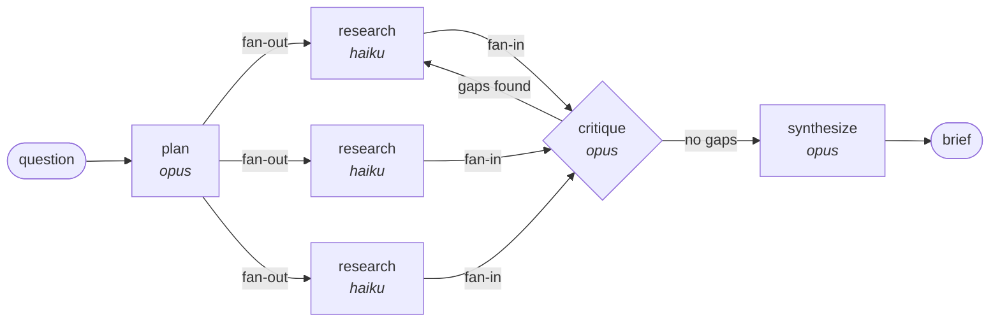

# Graph Engineering with Claude — a deep research agent in ~200 lines

A single agent loop is one node with an edge back to itself. **Graph engineering** is
what you get when you stop growing that one loop and start wiring several
specialised agents together instead.

This repo is the smallest honest example: a deep research agent built as a graph,
running on the Anthropic API. No orchestration framework — the graph is plain
`asyncio` and a dataclass, so you can read the whole thing in one sitting.

```bash
git clone <your-fork>
cd claude-graph-engineering
python3 -m venv .venv && .venv/bin/pip install -r requirements.txt
export ANTHROPIC_API_KEY=sk-ant-...
.venv/bin/python research_graph.py "How did AI agent frameworks change in 2026?"
```

---

## The three parts of a graph

| Part      | In theory                        | In this repo                                                     |
| --------- | -------------------------------- | ---------------------------------------------------------------- |
| **Nodes** | An agent or step that does one job | `plan`, `research_one`, `critique`, `synthesize`                  |
| **Edges** | The routing between nodes         | The `while` loop in `run()` — fan-out, fan-in, and one loop-back  |
| **State** | The data flowing along the edges  | The `State` dataclass — question, subquestions, findings, gaps    |



Four things in that picture are the whole lesson.

**1. Every worker gets a clean context window.** `research_one` is spawned once per
subquestion. It reads its own search results and reports back a summary — the raw
pages never enter the lead's context. That is what lets the graph read far more
than one loop could hold.

**2. Fan-out is where the speed comes from.** `asyncio.gather` runs every
researcher at once. Wall-clock is the slowest single worker, not the sum.

**3. You pick the model per node.** Planning and writing are judgment work
(`claude-opus-5`); reading search results is bulk work (`claude-haiku-4-5`). A
single-agent loop has to run everything on one model. This is the cost control
you buy by splitting the work up.

**4. The loop-back edge is a real edge.** `critique` never wrote the findings, so
it reviews them honestly, and its verdict routes the graph: gaps go back to the
researchers, no gaps goes forward to the writer. `MAX_ROUNDS` bounds it — an
unbounded critic loop is how a graph burns your budget at 3am.

---

## Anthropic already ships this — they call it orchestrator-workers

"Graph engineering" is a new label on a pattern Anthropic documented in
[Building Effective Agents](https://www.anthropic.com/engineering/building-effective-agents)
as **orchestrator-workers**: a lead agent decomposes the task, delegates to
workers in parallel, and synthesises the results.

Their own [multi-agent research system](https://www.anthropic.com/engineering/multi-agent-research-system)
is exactly that shape — a lead agent plus parallel subagents — and they published
both halves of the trade:

- It **outperformed a single-agent Claude Opus 4 baseline by 90.2%** on an internal
  research eval.
- It used **~15x the tokens of a chat interaction** (a normal agent uses ~4x).

That second number is the part most graph-engineering hype skips, and it is why
this repo puts a hard `MAX_ROUNDS` and `MAX_SUBQUESTIONS` in the config. **You are
buying quality and parallelism with tokens.** Only worth it when the task genuinely
splits and the answer is worth the spend.

---

## When *not* to build a graph

Every node has to be a loop that reliably ships on its own. A graph of weak nodes
is just slop produced in parallel, at 15x the cost.

Skip the graph when:

- One agent with a clear verifier already does the job.
- The subtasks aren't independent — if step 2 needs step 1's output, that's a
  chain, not a fan-out, and a plain loop is simpler.
- The task is small. The delegation overhead (re-briefing each worker, reading
  its report) can exceed the work itself.

Reach for it when the work fans out — many sources, many files, many records —
or when reading everything would blow one context window.

---

## Fork it and try these

Each of these is a real graph-engineering concept, and each is a small diff here:

1. **Add a verifier node.** After `synthesize`, spawn an agent that checks every
   claim in the brief against the findings and flags unsupported ones. Route its
   verdict back into `synthesize`. (Writer–verifier is the highest-value pattern
   in the list.)
2. **Widen the fan-out with diverse lenses.** Instead of N researchers with the
   same prompt, give each a different angle — primary sources, critics,
   timeline — and see what redundancy misses that diversity catches.
3. **Make the loop bound dynamic.** Replace `MAX_ROUNDS` with "stop after 2
   consecutive rounds that surface nothing new." Unknown-size discovery needs a
   loop-until-dry condition, not a counter.
4. **Swap a node's model and measure.** Move `critique` to Haiku, or `research_one`
   to Sonnet, and watch cost and quality move. Per-node model choice is the
   cheapest lever in the whole design.
5. **Add a deterministic edge.** Right now every edge is decided in code. Make one
   a hard gate — e.g. refuse to reach `synthesize` unless every subquestion has
   findings — so it fires whether or not a model cooperates.

---

## Files

| File               | What's in it                                        |
| ------------------ | --------------------------------------------------- |
| `research_graph.py`| The whole graph: state, four nodes, and the runtime |
| `test_graph.py`    | Routing logic checks that cost no API credits       |

```bash
.venv/bin/python test_graph.py
```

---

## Sources

- [Building Effective Agents](https://www.anthropic.com/engineering/building-effective-agents) — the five composable patterns; orchestrator-workers is a graph in all but name.
- [How we built our multi-agent research system](https://www.anthropic.com/engineering/multi-agent-research-system) — the 90.2% and 15x-tokens figures, plus the honest failure modes.
- [Effective context engineering for AI agents](https://www.anthropic.com/engineering/effective-context-engineering-for-ai-agents) — why context isolation per node matters.
- [Claude Code subagents](https://code.claude.com/docs/en/sub-agents) — the same node/edge/state shape, without writing any code.

## License

MIT
